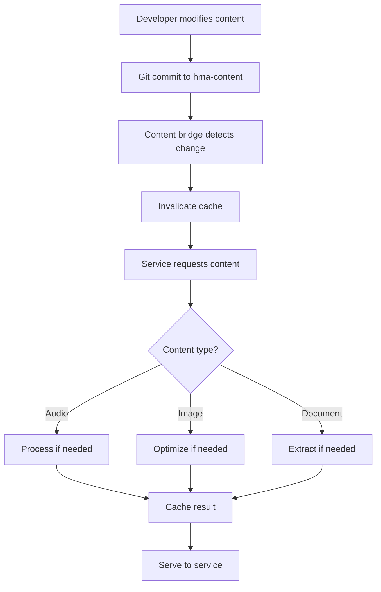

# HMA Infrastructure – MVP TODO

This checklist is organized for **phased, concurrent developer work**. Each section is a workstream with clear scope, status, acceptance criteria, and suggested assignees. Use this to plan, assign, and track work across Docker, Database, Scripts, Monitoring, Security, and Docs.

Legend: [x] Done • [~] In Progress • [ ] TODO • (Optional) Nice-to-have for MVP+.

---

## Phase 0: MVP Definition & Planning

- [ ] **MVP Goal**: Local dev stack with Postgres+PostGIS, Redis, MinIO, Adminer, Redis Commander, and ML stub; minimal schemas, seeds, backups, and health scripts for early app development.
- [ ] **Success Criteria**:
  - Bring-up: Single command boots all services healthy on fresh machine.
  - DB: Core schemas present; migrations/seed runnable; backup/restore works.
  - Security: Password-protected Redis; distinct DB app user; .env not committed.
  - Observability: Basic scripts for DB/Redis stats; logs directories; minimal alerts doc.

---

## Phase 1: Docker/Compose Stack (Assignee: Infra/DevOps)

- [x] Compose file under `docker/docker-compose.yml` with services: postgres, redis, minio, adminer, redis-commander, ml-server.
- [x] Volumes for persistent data (Postgres, Redis, MinIO).
- [x] Healthchecks for core services (postgres, redis, minio).
- [x] Resource limits (memory) for Postgres.
- [~] Remove deprecated `version:` key from compose to silence warning.
  - Acceptance: `docker compose config` shows no deprecation warnings.
- [ ] Production/test variants aligned (`docker/docker-compose.prod.yml`, `docker/docker-compose.test.yml`) and documented deltas.
  - Acceptance: README docs list differences; files validate via `docker compose -f ... config`.
- [ ] Network naming consistency across scripts (ensure setup script derivation matches compose network).
  - Acceptance: MinIO bucket creation attaches to the correct network without manual tweaks.

---

## Phase 2: PostgreSQL Core (Assignee: DB Engineer)

- [x] Base image with PostGIS and extensions bootstrap via `/docker-entrypoint-initdb.d`.
- [x] Extensions enabled: uuid-ossp, pgcrypto, pg_trgm, btree_gin, btree_gist, postgis, postgis_topology, pg_stat_statements.
- [ ] Extensions considered (Optional): pgvector, timescaledb.
  - Decision/Acceptance: Document decision in README; if enabled, add install/init scripts and verify `CREATE EXTENSION` succeeds.
- [x] Schemas scaffolded: auth, users, content, progress, game_calls, hunt_strategy, stealth_scouting, tracking_recovery, gear_marksmanship, ml_infrastructure, analytics, events.
- [ ] Roles & privileges
  - [x] `hma_admin` superuser from container env
  - [x] `hma_app` application user with grants
  - [x] `analytics_reader` read-only role
  - [ ] Default privileges per schema for app and analytics roles
  - Acceptance: Connecting as `hma_app` can SELECT/INSERT in allowed schemas; `analytics_reader` can only SELECT in `analytics`.
- [ ] Row-Level Security (RLS) on sensitive tables (auth.* as baseline)
  - Acceptance: RLS enabled; policies exist; unauthorized access denied in tests.
- [ ] Maintenance settings and helpers
  - [ ] `pg_stat_statements` settings verified; sample query to confirm tracking
  - [ ] Vacuum/Analyze guidance in docs

---

## Phase 3: Database Schema & Migrations (Assignee: DB Engineer)

- [x] Minimal starter schema in `database/init/schema.sql` (auth.users, ml_infrastructure.model_registry, content.assets).
- [ ] Versioned migrations in `database/migrations/` for full MVP tables:
  - [ ] auth: users, refresh_tokens, sessions, legal_acceptance, audit_log (partitioned monthly), breach_log (Optional)
  - [ ] content: assets, topics, content_items, content_topics (xref)
  - [ ] progress: lessons, user_progress, badges (Optional)
  - [ ] ml_infrastructure: model_registry, processing_jobs, model_metrics
  - [ ] events: event_log (partitioned monthly) (Optional for MVP)
  - [ ] indexes, FKs, CHECK constraints (age >= 18), unique constraints
  - Acceptance: `./scripts/migrate.sh` applies cleanly on empty DB; `status` shows applied list.
- [ ] Migration tracking table (e.g., `public.schema_migrations`) + idempotent script runner.
  - Acceptance: Re-running migrations is a no-op; status reflects up-to-date.

---

## Phase 4: Seeds & Reference Data (Assignee: DB Engineer)

- [x] Demo data seed added: `database/seeds/05_demo_data.sql`
- [ ] Seed scripts for broader reference data (topics, curriculum, ML catalogs)
- [x] Acceptance: `./scripts/seed.sh database/seeds/05_demo_data.sql` populates DB; verification queries return expected counts.

---

## Phase 5: Scripts & Automation (Assignee: Infra/DevOps)

- [ ] Health check scripts for DB, Redis, MinIO (`scripts/health-check.sh`).
- [ ] Backup/restore scripts for DB and Redis (`scripts/backup-database.sh`, `scripts/backup/backup-redis.sh`, `scripts/restore-database.sh`).
- [ ] Stats scripts for DB/Redis (`scripts/db-stats.sh`, `scripts/cache-stats.sh`).
- [ ] Acceptance: All scripts run without error; logs written to `/logs/`.

---

## Phase 6: Monitoring & Observability (Assignee: Infra/DevOps)

- [ ] Prometheus config for DB/Redis metrics (`monitoring/prometheus.yml`).
- [ ] Grafana dashboard stub for MVP metrics.
- [ ] Alerting doc stub in `docs/`.
- [ ] Acceptance: Prometheus scrapes DB/Redis; alerts fire on backup failure and slow queries.

---

## Phase 7: Security & Compliance (Assignee: Security/Compliance)

- [ ] Password-protected Redis; .env not committed.
- [ ] Audit log and breach log tables in DB.
- [ ] Compliance doc in `docs/compliance-strategy.md`.
- [ ] Acceptance: Security checks pass; compliance doc reviewed.

---

## Phase 8: Documentation (Assignee: Docs/Infra)

- [ ] README updated with architecture, setup, and operational notes.
- [ ] Docs in `docs/` folder completed (backup-recovery, compliance-strategy, scaling-strategy, database-design, design_planning).
- [ ] Acceptance: All docs reviewed and merged.

---

## Phase 9: Stretch Goals (Optional, assign as available)

- [ ] TimescaleDB/pgvector extensions enabled and tested
- [ ] ML server autoscaling
- [ ] Offsite backup rotation
- [ ] Full CI/CD pipeline for infra

## 1) Docker/Compose Stack

- [x] Compose file under `docker/docker-compose.yml` with services: postgres, redis, minio, adminer, redis-commander, ml-server.
- [x] Volumes for persistent data (Postgres, Redis, MinIO).
- [x] Healthchecks for core services (postgres, redis, minio).
- [x] Resource limits (memory) for Postgres.
- [~] Remove deprecated `version:` key from compose to silence warning.
  - Acceptance: `docker compose config` shows no deprecation warnings.
- [ ] Production/test variants aligned (`docker/docker-compose.prod.yml`, `docker/docker-compose.test.yml`) and documented deltas.
  - Acceptance: README docs list differences; files validate via `docker compose -f ... config`.
- [ ] Network naming consistency across scripts (ensure setup script derivation matches compose network).
  - Acceptance: MinIO bucket creation attaches to the correct network without manual tweaks.

## 2) PostgreSQL (Core)

- [x] Base image with PostGIS and extensions bootstrap via `/docker-entrypoint-initdb.d`.
- [x] Extensions enabled: uuid-ossp, pgcrypto, pg_trgm, btree_gin, btree_gist, postgis, postgis_topology, pg_stat_statements.
- [ ] Extensions considered (Optional): pgvector, timescaledb.
  - Decision/Acceptance: Document decision in README; if enabled, add install/init scripts and verify `CREATE EXTENSION` succeeds.
- [x] Schemas scaffolded: auth, users, content, progress, game_calls, hunt_strategy, stealth_scouting, tracking_recovery, gear_marksmanship, ml_infrastructure, analytics, events.
- [ ] Roles & privileges
  - [x] `hma_admin` superuser from container env
  - [x] `hma_app` application user with grants
  - [x] `analytics_reader` read-only role
  - [ ] Default privileges per schema for app and analytics roles
  - Acceptance: Connecting as `hma_app` can SELECT/INSERT in allowed schemas; `analytics_reader` can only SELECT in `analytics`.
- [ ] Row-Level Security (RLS) on sensitive tables (auth.* as baseline)
  - Acceptance: RLS enabled; policies exist; unauthorized access denied in tests.
- [ ] Maintenance settings and helpers
  - [ ] `pg_stat_statements` settings verified; sample query to confirm tracking
  - [ ] Vacuum/Analyze guidance in docs

## 3) Database Schema & Migrations

- [x] Minimal starter schema in `database/init/schema.sql` (auth.users, ml_infrastructure.model_registry, content.assets).
- [ ] Versioned migrations in `database/migrations/` for full MVP tables:
  - [ ] auth: users, refresh_tokens, sessions, legal_acceptance, audit_log (partitioned monthly), breach_log (Optional)
  - [ ] content: assets, topics, content_items, content_topics (xref)
  - [ ] progress: lessons, user_progress, badges (Optional)
  - [ ] ml_infrastructure: model_registry, processing_jobs, model_metrics
  - [ ] events: event_log (partitioned monthly) (Optional for MVP)
  - [ ] indexes, FKs, CHECK constraints (age >= 18), unique constraints
  - Acceptance: `./scripts/migrate.sh` applies cleanly on empty DB; `status` shows applied list.
- [ ] Migration tracking table (e.g., `public.schema_migrations`) + idempotent script runner.
  - Acceptance: Re-running migrations is a no-op; status reflects up-to-date.
- [ ] Seed data in `database/seeds/` for reference data and test users.
  - Acceptance: `./scripts/seed.sh` runs successfully; can seed all or specific file; `--test-users` works.
- [ ] Triggers & functions for audit logging, updated_at, and soft deletes.
  - Acceptance: INSERT/UPDATE/DELETE actions are captured in audit_log; updated_at auto-updates.

## 4) Security & Compliance (DB-first)

- [ ] Age gate enforcement
  - [ ] CHECK constraint on `auth.users.birth_date` ensures >= 18 years
  - [ ] Registration denial logged to `auth.audit_log`
  - Acceptance: Attempt to insert under-18 user fails and logs.
- [ ] Audit logging
  - [ ] `auth.audit_log` table partitioned monthly
  - [ ] Trigger-based inserts capturing actor, action, table, before/after (jsonb), ip/device (Optional)
  - Acceptance: Partitions auto-created for current month; writes route correctly.
- [ ] Data minimization & retention
  - [ ] Soft-delete with 30-day retention policy documented (and enforced where applicable)
  - [ ] PII encryption where needed (pgcrypto or app-level)
- [ ] Least-privilege roles documented (who uses what in dev/prod).

## 5) Redis (Cache/Queues)

- [x] Password-protected with `--requirepass` pulled from `.env`.
- [x] Persistence enabled with appendonly.
- [ ] Baseline keyspace and TTL conventions documented (e.g., 5m for hot data).
- [ ] Optional: Separate DB indexes for queues vs cache documented.

## 6) MinIO (Object Storage)

- [x] Local S3-compatible storage with console.
- [x] Buckets created: `huntmaster-media`, `huntmaster-models`, `huntmaster-backups` via setup script.
- [ ] Access policies (Optional): read-only/public for selected prefixes documented.
- [ ] Sample upload/download script (Optional) for dev verification.

## 7) ML Server (Stub)

- [x] FastAPI stub builds and runs in compose; exposes basic health/info.
- [ ] Minimal endpoints contract documented (e.g., `/health`, `/predict` noop, `/models` list from registry).
- [ ] Integration test script calls ML endpoints and verifies 200 OK.

## 8) Scripts & Tooling

- [x] `scripts/setup-dev-environment.sh` bootstraps `.env`, directories, services, DB init, and MinIO buckets.
- [x] Migration script (`scripts/migrate.sh`) with apply/status; rollback placeholder.
- [x] Seed script (`scripts/seed.sh`) supporting all/single/`--test-users`.
- [x] Backup/restore/reset scripts present.
- [x] Monitoring helpers: `db-stats.sh`, `slow-queries.sh`, `cache-stats.sh`.
- [ ] Implement rollback in `migrate.sh` (or adopt Flyway/Liquibase).
  - Acceptance: `rollback` reverses last migration or errors with clear guidance.
- [ ] Add `Makefile` convenience targets (Optional): make up/down/migrate/seed/backup.

## 9) Monitoring & Observability

- [ ] Compose services for Prometheus (and optionally Grafana) (Optional for MVP+).
  - Acceptance: Prometheus scrapes Postgres exporter and app endpoints; basic dashboard loads.
- [ ] Postgres exporter container and default scrape config (Optional).
- [ ] Logging:
  - [x] Central `/logs` directory exists
  - [ ] Log rotation guidance or sample config documented
- [ ] Alerts: Write initial runbook and example alert rules in `monitoring/` (Optional).

## 10) Backups & Disaster Recovery

- [x] Manual backup and restore scripts.
- [ ] Scheduled backups (cron/systemd or containerized job) with retention policy.
  - Acceptance: Daily backup artifacts land in `database/backups/`; oldest pruned per retention.
- [ ] Restore test automation (`scripts/backup/test-restore.sh`) included in CI weekly (Optional).
- [ ] Document offsite strategy for production (Optional; pointer to hma-deployment).

## 11) CI/CD & Quality Gates

- [ ] CI pipeline (Optional for MVP) that:
  - [ ] Lints SQL (psql parse or sqlfluff) and shell (shellcheck)
  - [ ] Spins up compose for smoke tests (DB connect, migrations, seeds)
  - [ ] Runs backup/restore test on ephemeral DB
  - Acceptance: PR status checks must pass before merge.

## 12) Documentation

- [x] Comprehensive README covering architecture, ops, compliance, and troubleshooting.
- [x] Docs stubs: `docs/database-design.md`, `docs/compliance-strategy.md`, `docs/scaling-strategy.md`, `docs/backup-recovery.md`.
- [ ] Keep README in sync with compose filenames and commands (compose v2 syntax).
 - [x] Add `MVP_TODO.md` link to README (Optional nicety).
- [ ] Add runbooks: onboarding, common ops, recovery drills (Optional).

## 13) Environments & Config

- [x] `.env` generation with secure defaults.
- [x] `.gitignore` excludes secrets, backups, logs, models.
- [ ] Parameterize sensible defaults via env for ports, memory, and paths where helpful.
- [ ] Document differences between dev/test/prod and how to override.

## 14) Performance Targets (MVP readiness)

- [ ] Indexes on FKs and common lookups created in migrations.
- [ ] GIN indexes for JSONB/text search where applicable.
- [ ] Partitioning for `auth.audit_log` (and `events.event_log` if included).
- [ ] Quick benchmarks doc for typical queries; link to `./scripts/slow-queries.sh`.

---

## Quick Wins to Tackle Next

1) Remove compose `version:` key and validate config is clean.  
2) Add migration tracking table and cut first real migrations for auth (users, sessions, legal_acceptance, audit_log + partitions).  
3) Implement `migrate.sh rollback` for last migration or document Flyway adoption.  
4) Add minimal `/health` endpoint test for ML server and wire into a smoke test script.  
5) Schedule daily backups with retention (7-14 days) and document restore procedure.

## Notes

- TimescaleDB/pgvector are optional for MVP; add when needed by features. If adopting, prefer an image that bundles the extension or a build step to install.
- Production Kubernetes specifics live in `hma-deployment`; this repo focuses on local/dev parity and DB schema ownership.

---

## Alpha Readiness Epics & Workstreams

This section captures the parallel work needed to reach alpha-testing readiness. Keep epic/task status updated here; no external project board is required. Suggested branch prefix: `ws/<workstream>/<short-topic>`.

Legend: Workstreams — A: Compose/Local Infra, B: Database/Migrations, C: Security/Compliance, D: CI/CD, E: Observability, F: ML Server, G: Backups/DR, H: Docs/DX.

### EPIC A1 – Compose Hardening (Workstream A)
Goals: Clean Compose v2 config, reliable bring-up, documented variants.
- [ ] A1.1 Remove deprecated `version:` key; validate config clean
- [ ] A1.2 Document dev/test/prod deltas in README; include ports/resources
- [ ] A1.3 Verify MinIO bucket creation uses the correct network name
Acceptance: `docker compose -f docker/docker-compose.yml config` has no warnings; setup script succeeds end-to-end on a clean machine.

### EPIC B1 – Auth Core Migrations (Workstream B)
Goals: Baseline auth schema with partitions and triggers.
- [ ] B1.1 Users, sessions, legal_acceptance tables with constraints and indexes
- [ ] B1.2 Partitioned `auth.audit_log` with current-month partition helper
- [ ] B1.3 `updated_at` trigger + audit triggers wired on auth tables
- [ ] B1.4 Seed test users; idempotent seeds and fixture refresh
Acceptance: `./scripts/migrate.sh apply` idempotent; under-18 insert fails; audit rows route to current month partition.

### EPIC B2 – RLS & Roles (Workstream B/C)
Goals: Least-privilege access and baseline RLS.
- [ ] B2.1 Default privileges per schema for `hma_app` and `analytics_reader`
- [ ] B2.2 Enable RLS on sensitive `auth.*` tables (owner-only baseline)
- [ ] B2.3 Role grant verification script or doc (connectivity matrix)
Acceptance: `hma_app` can SELECT/INSERT where allowed; `analytics_reader` SELECT-only in analytics; unauthorized access denied.

### EPIC C1 – Compliance Guardrails (Workstream C)
Goals: Enforce age gate and log denied registrations.
- [ ] C1.1 CHECK constraint for 18+ on `auth.users.birth_date`
- [ ] C1.2 Rejection path writes to `auth.audit_log` with reason and context
Acceptance: Inserting underage user fails with clear error and audit trail.

### EPIC D1 – CI Quality Gates (Workstream D)
Goals: Run-on-demand CI with timeouts and linters.
- [ ] D1.1 Add shellcheck for scripts (gated)
- [ ] D1.2 Add SQL lint or parse check (sqlfluff or `psql -c "EXPLAIN ..."` dry parses)
- [ ] D1.3 Keep current gates: alpha tags/manual/PR label + concurrency + path filters
Acceptance: CI passes when gated; all steps have explicit timeouts.

### EPIC E1 – Observability Bootstrap (Workstream E)
Goals: Troubleshooting visibility; optional Prometheus.
- [ ] E1.1 Ensure db-stats/slow-queries/cache-stats scripts document outputs
- [ ] E1.2 Optional: Add Prometheus + Postgres exporter compose and README notes
Acceptance: Scripts run with timeouts; optional stack scrapes metrics locally.

### EPIC F1 – ML Contract Baseline (Workstream F)
Goals: Minimal API and smoke coverage.
- [ ] F1.1 `/health` returns service/version; `/models` lists registry contents
- [ ] F1.2 Add smoke test script step for ML endpoints (timeout-protected)
Acceptance: Smoke step asserts 200 responses and basic payload contract.

### EPIC G1 – Scheduled Backups & Restore Test (Workstream G)
Goals: Daily backups with retention; restore confidence.
- [ ] G1.1 Add daily backup job (cron/compose) writing to `database/backups/`
- [ ] G1.2 Retention pruning (e.g., keep 7-14 days)
- [ ] G1.3 Automated restore test script for a fresh DB snapshot
Acceptance: Restore test passes; backup size/rotation documented.

### EPIC H1 – Docs & Onboarding (Workstream H)
Goals: Clear onboarding and runbooks.
- [ ] H1.1 Onboarding runbook: setup, common ops, smoke
- [ ] H1.2 Recovery drills: backup/restore walkthrough, failure scenarios
Acceptance: New dev can bring up stack in <10 minutes using docs.

Coordination Notes
- Prefer small PRs per sub-task; reference the EPIC code (e.g., A1.1)
- Always run local smoke with timeouts before pushing
- Keep this section as the single source of truth for epic/task status

# Content Integration Strategy for HMA Infrastructure

##  Architecture Recommendation: Federated Content with Local Proxy

Yes, it makes perfect sense to reference `hma-content` from `hma-infra`, but with a **federated architecture** that maintains separation of concerns while enabling seamless local development.

##  Content Repository Structure

### Recommended `hma-content` Organization
```yaml
hma-content/
├── audio/
│   ├── game-calls/
│   │   ├── master/                 # Original high-quality recordings
│   │   │   ├── elk/
│   │   │   │   ├── bugle-01.wav   # Master files (Git LFS)
│   │   │   │   └── metadata.json   # Recording conditions, equipment
│   │   │   ├── turkey/
│   │   │   └── whitetail/
│   │   ├── processed/              # ML-ready versions
│   │   │   ├── elk/
│   │   │   │   ├── bugle-01-16k.wav      # Downsampled
│   │   │   │   ├── bugle-01-features.npy  # Pre-computed features
│   │   │   │   └── bugle-01-spectrogram.png
│   │   └── training/               # Augmented training data
│   ├── ambient/                    # Environmental sounds
│   └── narration/                  # Lesson voiceovers
├── documents/
│   ├── research-papers/
│   │   ├── wildlife-behavior/
│   │   │   ├── elk-migration-2023.pdf (LFS)
│   │   │   ├── metadata.json
│   │   │   └── extracted/         # Processed content
│   │   │       ├── figures/
│   │   │       ├── tables/
│   │   │       └── text.md
│   │   └── ballistics/
│   └── regulations/
│       ├── states/
│       └── federal/
├── media/
│   ├── icons/
│   │   ├── animals/
│   │   │   ├── elk.svg
│   │   │   ├── elk@2x.png
│   │   │   └── elk@3x.png
│   │   ├── equipment/
│   │   ├── ui/
│   │   └── achievements/
│   ├── images/
│   │   ├── lessons/
│   │   ├── reference/
│   │   └── social/
│   ├── videos/
│   │   ├── tutorials/
│   │   └── field-guides/
│   └── 3d-models/
│       ├── animals/
│       └── equipment/
├── datasets/
│   ├── training/
│   │   ├── audio-classification/
│   │   └── image-recognition/
│   └── validation/
├── manifests/
│   ├── content-registry.json      # Master content index
│   ├── cdn-manifest.json          # CDN deployment map
│   └── version-history.json       # Content versioning
└── .gitattributes                  # LFS configuration
```

##  Integration Architecture

### 1. Content Bridge Service for Local Development

Create a **content bridge service** in `hma-infra` that simulates production content delivery:

```yaml
# hma-infra/docker/docker-compose.yml
services:
  # ... existing services ...
  
  content-bridge:
    build: ./services/content-bridge
    container_name: hma-content-bridge
    ports:
      - "8090:8090"
    volumes:
      # Mount hma-content repo
      - ${HMA_CONTENT_PATH:-../hma-content}:/content:ro
      # Mount generated assets
      - ./generated/content:/generated
      # Cache for processed content
      - content-cache:/cache
    environment:
      - CONTENT_MODE=${CONTENT_MODE:-local}
      - S3_BUCKET=${CONTENT_BUCKET:-}
      - CDN_URL=${CDN_URL:-http://localhost:8090}
    depends_on:
      - minio
      - postgres
    healthcheck:
      test: ["CMD", "curl", "-f", "http://localhost:8090/health"]
      interval: 30s
      timeout: 10s
      retries: 3
```

### 2. Content Bridge Service Implementation

```python
# hma-infra/services/content-bridge/app.py
from fastapi import FastAPI, HTTPException, Response
from fastapi.staticfiles import StaticFiles
from fastapi.responses import FileResponse, StreamingResponse
import os
import json
import hashlib
from pathlib import Path
from typing import Optional
import boto3
from PIL import Image
import numpy as np
from pydub import AudioSegment
import redis
import asyncio

app = FastAPI(title="HMA Content Bridge", version="1.0.0")

# Configuration
CONTENT_ROOT = Path(os.getenv("CONTENT_ROOT", "/content"))
CACHE_DIR = Path(os.getenv("CACHE_DIR", "/cache"))
CONTENT_MODE = os.getenv("CONTENT_MODE", "local")  # local, hybrid, s3
S3_BUCKET = os.getenv("S3_BUCKET", "hma-content-alpha")
CDN_URL = os.getenv("CDN_URL", "http://localhost:8090")

# Redis cache for metadata
redis_client = redis.Redis(host='redis', port=6379, decode_responses=True)

# S3 client for hybrid mode
if CONTENT_MODE in ["hybrid", "s3"]:
    s3_client = boto3.client('s3')

class ContentService:
    """Simulates production content delivery with local files"""
    
    async def get_audio_file(
        self, 
        category: str, 
        species: str, 
        filename: str, 
        format: Optional[str] = None,
        sample_rate: Optional[int] = None
    ):
        """Get audio file with optional on-the-fly conversion"""
        
        # Check cache first
        cache_key = f"audio:{category}:{species}:{filename}:{format}:{sample_rate}"
        cached_path = CACHE_DIR / hashlib.md5(cache_key.encode()).hexdigest()
        
        if cached_path.exists():
            return FileResponse(cached_path)
        
        # Build source path
        source_path = CONTENT_ROOT / "audio" / category / species / filename
        
        if not source_path.exists():
            # Try S3 in hybrid mode
            if CONTENT_MODE == "hybrid":
                return await self.get_from_s3(f"audio/{category}/{species}/{filename}")
            raise HTTPException(status_code=404, detail="Audio file not found")
        
        # Process audio if needed
        if format or sample_rate:
            processed = await self.process_audio(source_path, format, sample_rate)
            processed.export(cached_path, format=format or "wav")
            return FileResponse(cached_path)
        
        return FileResponse(source_path)
    
    async def process_audio(self, path: Path, format: str, sample_rate: int):
        """Process audio file for ML consumption"""
        audio = AudioSegment.from_file(path)
        
        if sample_rate:
            audio = audio.set_frame_rate(sample_rate)
        
        # Add more processing as needed (normalization, etc.)
        return audio
    
    async def get_icon(
        self,
        category: str,
        name: str,
        size: Optional[str] = None  # @2x, @3x for mobile
    ):
        """Get icon with responsive sizing"""
        base_path = CONTENT_ROOT / "media" / "icons" / category
        
        # Try exact match first
        if size:
            icon_path = base_path / f"{name}{size}.png"
            if icon_path.exists():
                return FileResponse(icon_path)
        
        # Fall back to SVG
        svg_path = base_path / f"{name}.svg"
        if svg_path.exists():
            return FileResponse(svg_path, media_type="image/svg+xml")
        
        # Fall back to base PNG
        png_path = base_path / f"{name}.png"
        if png_path.exists():
            return FileResponse(png_path)
        
        raise HTTPException(status_code=404, detail="Icon not found")
    
    async def get_research_paper(self, category: str, paper_id: str, extract: Optional[str] = None):
        """Get research paper or extracted content"""
        paper_path = CONTENT_ROOT / "documents" / "research-papers" / category / f"{paper_id}.pdf"
        
        if extract:
            # Return extracted content (figures, tables, text)
            extract_path = paper_path.parent / "extracted" / extract
            if extract_path.exists():
                return FileResponse(extract_path)
        
        if paper_path.exists():
            return FileResponse(paper_path, media_type="application/pdf")
        
        raise HTTPException(status_code=404, detail="Paper not found")
    
    async def get_ml_features(self, audio_id: str):
        """Get pre-computed ML features for audio"""
        features_path = CONTENT_ROOT / "audio" / "processed" / f"{audio_id}-features.npy"
        
        if features_path.exists():
            features = np.load(features_path)
            return {
                "audio_id": audio_id,
                "features": features.tolist(),
                "shape": features.shape,
                "dtype": str(features.dtype)
            }
        
        # Generate on-the-fly if not cached
        audio_path = self.find_audio_file(audio_id)
        if audio_path:
            features = await self.extract_features(audio_path)
            np.save(features_path, features)
            return {
                "audio_id": audio_id,
                "features": features.tolist(),
                "shape": features.shape
            }
        
        raise HTTPException(status_code=404, detail="Audio file not found")

content_service = ContentService()

# API Endpoints
@app.get("/health")
async def health():
    return {
        "status": "healthy",
        "mode": CONTENT_MODE,
        "content_root": str(CONTENT_ROOT),
        "cdn_url": CDN_URL
    }

@app.get("/api/audio/{category}/{species}/{filename}")
async def get_audio(
    category: str,
    species: str,
    filename: str,
    format: Optional[str] = None,
    sample_rate: Optional[int] = None
):
    return await content_service.get_audio_file(
        category, species, filename, format, sample_rate
    )

@app.get("/api/icons/{category}/{name}")
async def get_icon(
    category: str,
    name: str,
    size: Optional[str] = None
):
    return await content_service.get_icon(category, name, size)

@app.get("/api/research/{category}/{paper_id}")
async def get_research(
    category: str,
    paper_id: str,
    extract: Optional[str] = None
):
    return await content_service.get_research_paper(category, paper_id, extract)

@app.get("/api/ml/features/{audio_id}")
async def get_ml_features(audio_id: str):
    return await content_service.get_ml_features(audio_id)

@app.get("/api/manifest")
async def get_content_manifest():
    """Return content registry for service discovery"""
    manifest_path = CONTENT_ROOT / "manifests" / "content-registry.json"
    if manifest_path.exists():
        with open(manifest_path) as f:
            return json.load(f)
    return {"error": "Manifest not found"}

# Static file serving for development
app.mount("/static", StaticFiles(directory=str(CONTENT_ROOT)), name="static")
```

## 🧪 Alpha Testing Methodology

### 1. Local Development Setup Script

```bash
#!/bin/bash
# hma-infra/scripts/setup-content-dev.sh

set -e

echo " Setting up HMA content development environment..."

# Check if hma-content repo exists
CONTENT_PATH="${HMA_CONTENT_PATH:-../hma-content}"

if [ ! -d "$CONTENT_PATH" ]; then
    echo "📥 Cloning hma-content repository..."
    git clone https://github.com/huntmaster/hma-content.git "$CONTENT_PATH"
    
    # Initialize Git LFS
    cd "$CONTENT_PATH"
    git lfs install
    git lfs pull
    cd -
fi

# Create sample content for testing if needed
if [ ! -f "$CONTENT_PATH/audio/game-calls/elk/sample.wav" ]; then
    echo "🎵 Generating sample audio files..."
    python scripts/generate-test-content.py --type audio --path "$CONTENT_PATH"
fi

# Sync content to MinIO for hybrid testing
echo "☁️ Syncing content to local MinIO..."
docker compose exec minio mc alias set local http://localhost:9000 minioadmin minioadmin
docker compose exec minio mc mb --ignore-existing local/hma-content-alpha
docker compose exec minio mc mirror "$CONTENT_PATH" local/hma-content-alpha

# Build and start content bridge
echo "🌉 Starting content bridge service..."
docker compose up -d content-bridge

# Wait for health check
echo "⏳ Waiting for content bridge to be healthy..."
timeout 30 bash -c 'until curl -f http://localhost:8090/health > /dev/null 2>&1; do sleep 1; done'

echo " Content development environment ready!"
echo ""
echo " Content API available at: http://localhost:8090"
echo " Content directory: $CONTENT_PATH"
echo "🔍 MinIO console: http://localhost:9001"
```

### 2. Content Testing Framework

```python
# hma-infra/tests/test_content_integration.py
import pytest
import requests
import numpy as np
from pathlib import Path
import json

BASE_URL = "http://localhost:8090"

class TestContentIntegration:
    """Test content delivery simulation for alpha testing"""
    
    def test_audio_retrieval(self):
        """Test fetching master audio files"""
        response = requests.get(f"{BASE_URL}/api/audio/game-calls/elk/bugle-01.wav")
        assert response.status_code == 200
        assert response.headers["content-type"] == "audio/wav"
        assert len(response.content) > 1000  # Should have actual content
    
    def test_audio_processing(self):
        """Test on-the-fly audio processing"""
        response = requests.get(
            f"{BASE_URL}/api/audio/game-calls/elk/bugle-01.wav",
            params={"format": "mp3", "sample_rate": 16000}
        )
        assert response.status_code == 200
        assert response.headers["content-type"] == "audio/mp3"
    
    def test_ml_features(self):
        """Test ML feature extraction"""
        response = requests.get(f"{BASE_URL}/api/ml/features/bugle-01")
        assert response.status_code == 200
        data = response.json()
        assert "features" in data
        assert "shape" in data
        
        # Verify features are correct shape for model input
        features = np.array(data["features"])
        assert features.shape[0] > 0
    
    def test_icon_delivery(self):
        """Test responsive icon delivery"""
        # Test SVG delivery
        response = requests.get(f"{BASE_URL}/api/icons/animals/elk")
        assert response.status_code == 200
        assert "svg" in response.headers["content-type"]
        
        # Test high-res PNG
        response = requests.get(f"{BASE_URL}/api/icons/animals/elk?size=@3x")
        assert response.status_code == 200
        assert "png" in response.headers["content-type"]
    
    def test_research_paper_access(self):
        """Test research paper and extraction"""
        # Get full paper
        response = requests.get(f"{BASE_URL}/api/research/wildlife-behavior/elk-migration-2023")
        assert response.status_code == 200
        assert response.headers["content-type"] == "application/pdf"
        
        # Get extracted figure
        response = requests.get(
            f"{BASE_URL}/api/research/wildlife-behavior/elk-migration-2023",
            params={"extract": "figures/fig1.png"}
        )
        assert response.status_code == 200
    
    def test_content_manifest(self):
        """Test content registry for service discovery"""
        response = requests.get(f"{BASE_URL}/api/manifest")
        assert response.status_code == 200
        manifest = response.json()
        assert "audio" in manifest
        assert "documents" in manifest
        assert "media" in manifest

@pytest.fixture(scope="session", autouse=True)
def setup_test_content():
    """Ensure test content exists"""
    # This would create necessary test files
    pass
```

### 3. Service Integration Configuration

```yaml
# hma-infra/config/services/alpha.yaml
services:
  content:
    mode: local
    endpoints:
      audio: http://content-bridge:8090/api/audio
      media: http://content-bridge:8090/api/icons
      research: http://content-bridge:8090/api/research
      ml_features: http://content-bridge:8090/api/ml
      static: http://content-bridge:8090/static
    
  education:
    content_source: content.endpoints.static
    audio_processor: content.endpoints.audio
    
  gamecalls:
    master_audio: content.endpoints.audio
    features_api: content.endpoints.ml_features
    
  field-guide:
    icons: content.endpoints.media
    offline_manifest: content.endpoints.manifest
```

### 4. Progressive Environment Strategy

```yaml
# Environment-specific content delivery
environments:
  alpha:
    mode: local
    source: filesystem
    path: ../hma-content
    processing: on-demand
    caching: local-redis
    
  beta:
    mode: hybrid
    primary: s3
    fallback: filesystem
    cdn: cloudfront-staging
    processing: pre-computed
    caching: redis-cluster
    
  production:
    mode: cdn
    primary: cloudfront
    fallback: s3
    processing: pre-computed
    caching: multi-tier
    edge_locations: true
```

##  Development Workflow

### Local Development Cycle



### Testing Workflow

```bash
#!/bin/bash
# hma-infra/scripts/test-content-integration.sh

# 1. Start infrastructure
docker compose up -d

# 2. Wait for services
./scripts/wait-for-healthy.sh

# 3. Load test content
./scripts/load-test-content.sh

# 4. Run integration tests
pytest tests/test_content_integration.py -v

# 5. Test service endpoints
curl http://localhost:8090/api/audio/game-calls/elk/bugle-01.wav -o test.wav
curl http://localhost:8090/api/icons/animals/elk -o test.svg
curl http://localhost:8090/api/manifest | jq .

# 6. Verify ML pipeline
python scripts/test-ml-pipeline.py --audio test.wav
```

##  Benefits of This Approach

### 1. **Separation of Concerns**
- Content versioning separate from infrastructure
- Different teams can manage content vs. infrastructure
- Clean boundaries between data and code

### 2. **Realistic Testing**
- Local setup mimics production CDN behavior
- Services use same API paths locally and in production
- Easy to test edge cases and failures

### 3. **Performance Optimization**
- Pre-compute expensive operations (feature extraction)
- Cache frequently accessed content
- Progressive loading strategies

### 4. **Development Flexibility**
- Work with local files for rapid iteration
- Test with S3/CDN without deploying
- Switch between modes easily

##  Implementation Checklist

```markdown
## Content Integration MVP

### Week 1: Setup
- [ ] Create content-bridge service in hma-infra
- [ ] Set up Docker volumes for hma-content mounting
- [ ] Implement basic file serving endpoints
- [ ] Create health check and monitoring

### Week 2: Processing
- [ ] Add audio processing capabilities
- [ ] Implement image optimization
- [ ] Create feature extraction pipeline
- [ ] Set up caching layer

### Week 3: Integration
- [ ] Update service configurations to use content-bridge
- [ ] Create integration tests
- [ ] Document API endpoints
- [ ] Set up content manifest generation

### Week 4: Optimization
- [ ] Add CDN simulation for production parity
- [ ] Implement cache warming
- [ ] Create performance benchmarks
- [ ] Document deployment strategies
```

This approach provides a robust, scalable solution for managing content in alpha testing while maintaining clear separation between content and infrastructure repositories.