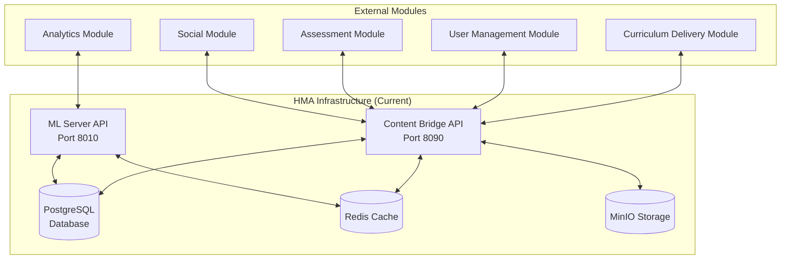

# Hunt Master Academy - Integration Compatibility Documentation

## Module Integration Specifications

This document outlines the integration compatibility of the Hunt Master Academy infrastructure with other platform modules, including curriculum delivery, user management, and analytics components.

---

## Integration Architecture Overview

### Current Integration Status

The Hunt Master Academy infrastructure is designed as a **foundational service layer** that provides core functionality for the broader Hunt Master Academy platform. The current implementation provides API endpoints and data structures that can integrate with:

1. **Curriculum Delivery Module** - Content management and delivery
2. **User Management Module** - Authentication, authorization, and user profiles  
3. **Analytics Module** - Learning analytics and performance tracking
4. **Assessment Module** - Testing and evaluation systems
5. **Social Module** - Community features and collaboration

### Integration Patterns



---

## Curriculum Delivery Module Integration

### Current Compatibility

#### Content API Endpoints
The Content Bridge API provides endpoints that are compatible with curriculum delivery systems:

```python
# Compatible endpoints for curriculum delivery
GET  /api/content/{content_id}     # Retrieve course content
POST /api/content/upload          # Upload new content
GET  /api/content/search          # Search course materials
POST /api/content/metadata        # Update content metadata
```

#### Content Data Structure
```json
{
  "content_id": "string",
  "title": "string", 
  "type": "video|document|interactive|assessment",
  "metadata": {
    "duration_minutes": "integer",
    "difficulty_level": "beginner|intermediate|advanced",
    "tags": ["array", "of", "strings"],
    "prerequisites": ["array", "of", "content_ids"],
    "learning_objectives": ["array", "of", "objectives"]
  },
  "content_url": "string",
  "thumbnail_url": "string",
  "created_at": "ISO8601 timestamp",
  "updated_at": "ISO8601 timestamp"
}
```

#### File Storage Integration
```python
# MinIO storage structure for curriculum content
huntmaster-storage/
├── content/
│   ├── videos/
│   │   ├── course_1/
│   │   │   ├── module_1_intro.mp4
│   │   │   └── module_1_transcript.vtt
│   │   └── course_2/
│   ├── documents/
│   │   ├── pdf/
│   │   │   ├── hunting_guide.pdf
│   │   │   └── safety_manual.pdf
│   │   └── interactive/
│   └── assessments/
│       ├── quizzes/
│       └── simulations/
```

### Integration Requirements

#### Content Delivery Pipeline
```python
# Example integration with curriculum delivery module
class CurriculumDeliveryIntegration:
    
    async def sync_course_content(self, course_id: str):
        """Sync course content from delivery module"""
        # Fetch course structure from curriculum delivery
        course_data = await self.curriculum_api.get_course(course_id)
        
        # Update local content registry
        for module in course_data.modules:
            await self.content_bridge.update_content({
                "content_id": module.id,
                "title": module.title,
                "type": module.type,
                "metadata": {
                    "course_id": course_id,
                    "sequence_number": module.sequence,
                    "duration_minutes": module.duration,
                    "prerequisites": module.prerequisites
                }
            })
    
    async def track_content_progress(self, user_id: str, content_id: str, progress: float):
        """Track user progress in curriculum content"""
        # Update progress in local database
        await self.database.update_user_progress(user_id, content_id, progress)
        
        # Sync progress back to curriculum delivery module
        await self.curriculum_api.update_progress(user_id, content_id, progress)
        
        # Trigger ML analysis for recommendations
        await self.ml_server.analyze_learning_pattern(user_id, content_id, progress)
```

#### Content Synchronization Protocol
```json
{
  "sync_protocol": {
    "method": "webhook",
    "endpoint": "POST /api/webhooks/curriculum/content-updated",
    "authentication": "bearer_token",
    "payload_format": {
      "event_type": "content_updated|content_created|content_deleted",
      "content_id": "string",
      "course_id": "string", 
      "timestamp": "ISO8601",
      "changes": {
        "field_name": "new_value"
      }
    }
  }
}
```

### Database Schema Integration

#### Curriculum-Compatible Tables
```sql
-- Course management tables compatible with curriculum delivery
CREATE TABLE IF NOT EXISTS courses (
    id SERIAL PRIMARY KEY,
    external_course_id VARCHAR(255) UNIQUE, -- ID from curriculum delivery module
    title VARCHAR(255) NOT NULL,
    description TEXT,
    instructor_id INTEGER,
    difficulty_level VARCHAR(50),
    estimated_hours INTEGER,
    metadata JSONB, -- Flexible metadata from curriculum module
    sync_status VARCHAR(50) DEFAULT 'pending',
    last_synced TIMESTAMP,
    created_at TIMESTAMP DEFAULT NOW(),
    updated_at TIMESTAMP DEFAULT NOW()
);

-- Content items linked to curriculum modules
CREATE TABLE IF NOT EXISTS content_items (
    id SERIAL PRIMARY KEY,
    external_content_id VARCHAR(255) UNIQUE, -- ID from curriculum delivery
    course_id INTEGER REFERENCES courses(id),
    title VARCHAR(255) NOT NULL,
    content_type VARCHAR(100), -- video, document, interactive, assessment
    file_path VARCHAR(500), -- Path in MinIO storage
    metadata JSONB,
    sequence_number INTEGER,
    prerequisites JSONB, -- Array of prerequisite content IDs
    sync_status VARCHAR(50) DEFAULT 'pending',
    created_at TIMESTAMP DEFAULT NOW(),
    updated_at TIMESTAMP DEFAULT NOW()
);
```

---

## User Management Module Integration

### Current Compatibility

#### User Authentication API
```python
# Compatible authentication endpoints
POST /api/authenticate          # User login
POST /api/users/register        # User registration  
GET  /api/users/{user_id}       # User profile
PUT  /api/users/{user_id}       # Update profile
POST /api/users/reset-password  # Password reset
```

#### User Data Structure
```json
{
  "user_id": "string",
  "username": "string",
  "email": "string", 
  "profile": {
    "first_name": "string",
    "last_name": "string",
    "avatar_url": "string",
    "bio": "string",
    "location": "string",
    "experience_level": "beginner|intermediate|expert",
    "interests": ["array", "of", "hunting", "interests"],
    "preferences": {
      "notification_settings": "object",
      "privacy_settings": "object"
    }
  },
  "roles": ["student", "instructor", "admin"],
  "created_at": "ISO8601 timestamp",
  "last_login": "ISO8601 timestamp"
}
```

### Integration Requirements

#### Single Sign-On (SSO) Integration
```python
# SSO integration with user management module
class UserManagementIntegration:
    
    async def validate_sso_token(self, token: str):
        """Validate SSO token from user management module"""
        try:
            # Validate token with user management service
            user_data = await self.user_mgmt_api.validate_token(token)
            
            # Create or update local user record
            local_user = await self.sync_user_data(user_data)
            
            # Generate local session token
            local_token = self.create_local_session(local_user.id)
            
            return {
                "valid": True,
                "user": local_user,
                "local_token": local_token
            }
            
        except ValidationError as e:
            return {"valid": False, "error": str(e)}
    
    async def sync_user_data(self, external_user: dict):
        """Sync user data from user management module"""
        # Check if user exists locally
        local_user = await self.get_user_by_external_id(external_user["id"])
        
        if not local_user:
            # Create new local user
            local_user = await self.create_user({
                "external_user_id": external_user["id"],
                "username": external_user["username"],
                "email": external_user["email"],
                "profile": external_user["profile"],
                "roles": external_user["roles"]
            })
        else:
            # Update existing user
            await self.update_user(local_user.id, {
                "profile": external_user["profile"],
                "roles": external_user["roles"],
                "last_synced": datetime.now()
            })
        
        return local_user
```

#### User Sync Protocol
```json
{
  "user_sync_protocol": {
    "method": "webhook",
    "endpoint": "POST /api/webhooks/users/profile-updated", 
    "authentication": "bearer_token",
    "payload_format": {
      "event_type": "user_created|user_updated|user_deleted|role_changed",
      "user_id": "string",
      "timestamp": "ISO8601",
      "changes": {
        "field_name": "new_value"
      }
    }
  }
}
```

### Database Schema Integration

#### User Management Compatible Tables
```sql
-- Users table compatible with external user management
CREATE TABLE IF NOT EXISTS users (
    id SERIAL PRIMARY KEY,
    external_user_id VARCHAR(255) UNIQUE, -- ID from user management module
    username VARCHAR(255) UNIQUE NOT NULL,
    email VARCHAR(255) UNIQUE NOT NULL,
    profile_data JSONB, -- Flexible profile data from user mgmt
    roles JSONB, -- Array of role strings
    sync_status VARCHAR(50) DEFAULT 'pending',
    last_synced TIMESTAMP,
    created_at TIMESTAMP DEFAULT NOW(),
    updated_at TIMESTAMP DEFAULT NOW()
);

-- User sessions for local authentication
CREATE TABLE IF NOT EXISTS user_sessions (
    id SERIAL PRIMARY KEY,
    user_id INTEGER REFERENCES users(id),
    session_token VARCHAR(500) NOT NULL,
    external_token VARCHAR(500), -- SSO token from user management
    expires_at TIMESTAMP NOT NULL,
    created_at TIMESTAMP DEFAULT NOW()
);

-- User progress tracking
CREATE TABLE IF NOT EXISTS user_progress (
    id SERIAL PRIMARY KEY,
    user_id INTEGER REFERENCES users(id),
    course_id INTEGER REFERENCES courses(id),
    content_id INTEGER REFERENCES content_items(id),
    progress_percentage DECIMAL(5,2),
    time_spent_minutes INTEGER,
    last_accessed TIMESTAMP,
    completed_at TIMESTAMP,
    metadata JSONB, -- Additional progress data
    created_at TIMESTAMP DEFAULT NOW(),
    updated_at TIMESTAMP DEFAULT NOW(),
    UNIQUE(user_id, content_id)
);
```

---

## Analytics Module Integration

### Current Compatibility

#### Analytics Data API
```python
# Compatible analytics endpoints
POST /api/analytics/events        # Track learning events
GET  /api/analytics/user/{user_id} # User analytics
GET  /api/analytics/content/{id}   # Content analytics
POST /api/analytics/reports        # Generate reports
```

#### Event Data Structure
```json
{
  "event_id": "string",
  "event_type": "content_view|progress_update|assessment_complete|login|logout",
  "user_id": "string",
  "session_id": "string",
  "timestamp": "ISO8601",
  "context": {
    "course_id": "string",
    "content_id": "string",
    "device_type": "desktop|mobile|tablet",
    "browser": "string",
    "ip_address": "string"
  },
  "data": {
    "progress_percentage": "number",
    "time_spent_seconds": "number",
    "score": "number",
    "custom_fields": "object"
  }
}
```

### Integration Requirements

#### Event Streaming Integration
```python
# Analytics event streaming integration
class AnalyticsIntegration:
    
    async def track_learning_event(self, event_data: dict):
        """Track learning event for analytics"""
        # Store event locally for ML processing
        await self.store_local_event(event_data)
        
        # Stream event to analytics module
        await self.analytics_api.send_event(event_data)
        
        # Trigger ML analysis if applicable
        if event_data["event_type"] in ["progress_update", "assessment_complete"]:
            await self.ml_server.analyze_learning_event(event_data)
    
    async def generate_learning_analytics(self, user_id: str, timeframe: str):
        """Generate learning analytics for user"""
        # Get local learning data
        local_data = await self.get_local_analytics(user_id, timeframe)
        
        # Get analytics from analytics module
        external_data = await self.analytics_api.get_user_analytics(user_id, timeframe)
        
        # Combine and enrich with ML insights
        ml_insights = await self.ml_server.get_learning_insights(user_id)
        
        return {
            "local_analytics": local_data,
            "platform_analytics": external_data, 
            "ml_insights": ml_insights,
            "recommendations": await self.generate_recommendations(user_id)
        }
```

#### Real-time Analytics Pipeline
```python
# Real-time analytics data pipeline
class AnalyticsDataPipeline:
    
    def __init__(self):
        self.event_queue = asyncio.Queue()
        self.batch_size = 100
        self.flush_interval = 10  # seconds
    
    async def queue_event(self, event: dict):
        """Queue event for batch processing"""
        await self.event_queue.put(event)
    
    async def process_event_batch(self):
        """Process events in batches for analytics"""
        events = []
        
        # Collect events for batch
        while len(events) < self.batch_size:
            try:
                event = await asyncio.wait_for(
                    self.event_queue.get(), 
                    timeout=self.flush_interval
                )
                events.append(event)
            except asyncio.TimeoutError:
                break
        
        if events:
            # Send batch to analytics module
            await self.analytics_api.send_event_batch(events)
            
            # Process locally for ML
            await self.ml_server.process_event_batch(events)
```

### Database Schema Integration

#### Analytics Compatible Tables
```sql
-- Learning events for analytics
CREATE TABLE IF NOT EXISTS learning_events (
    id SERIAL PRIMARY KEY,
    event_id VARCHAR(255) UNIQUE,
    event_type VARCHAR(100) NOT NULL,
    user_id INTEGER REFERENCES users(id),
    course_id INTEGER REFERENCES courses(id),
    content_id INTEGER REFERENCES content_items(id),
    session_id VARCHAR(255),
    event_data JSONB, -- Flexible event data
    context_data JSONB, -- Device, browser, etc.
    processed_at TIMESTAMP,
    synced_to_analytics BOOLEAN DEFAULT FALSE,
    created_at TIMESTAMP DEFAULT NOW()
);

-- Analytics aggregations for quick queries
CREATE TABLE IF NOT EXISTS analytics_summaries (
    id SERIAL PRIMARY KEY,
    user_id INTEGER REFERENCES users(id),
    course_id INTEGER REFERENCES courses(id),
    summary_date DATE,
    total_time_minutes INTEGER,
    content_items_accessed INTEGER,
    progress_made DECIMAL(5,2),
    assessments_completed INTEGER,
    average_score DECIMAL(5,2),
    created_at TIMESTAMP DEFAULT NOW(),
    UNIQUE(user_id, course_id, summary_date)
);
```

---

## Assessment Module Integration

### Current Compatibility

#### Assessment API Endpoints
```python
# Compatible assessment endpoints
GET  /api/assessments/{assessment_id}  # Get assessment
POST /api/assessments/submit           # Submit assessment
GET  /api/assessments/results/{id}     # Get results
POST /api/assessments/grade            # Grade assessment
```

#### Assessment Data Structure
```json
{
  "assessment_id": "string",
  "title": "string",
  "type": "quiz|simulation|practical|certification",
  "questions": [
    {
      "question_id": "string",
      "type": "multiple_choice|true_false|short_answer|essay",
      "question_text": "string",
      "options": ["array", "for", "multiple", "choice"],
      "correct_answer": "string|array",
      "points": "number",
      "metadata": "object"
    }
  ],
  "time_limit_minutes": "number",
  "passing_score": "number",
  "attempts_allowed": "number",
  "metadata": {
    "course_id": "string",
    "difficulty_level": "string",
    "prerequisites": ["array"]
  }
}
```

### Integration Requirements

#### Assessment Results Integration
```python
# Assessment module integration
class AssessmentIntegration:
    
    async def process_assessment_submission(self, submission_data: dict):
        """Process assessment submission"""
        # Store submission locally
        submission = await self.store_assessment_submission(submission_data)
        
        # Send to assessment module for grading
        grading_result = await self.assessment_api.grade_submission(submission_data)
        
        # Update local records with results
        await self.update_submission_results(submission.id, grading_result)
        
        # Trigger analytics event
        await self.analytics.track_learning_event({
            "event_type": "assessment_complete",
            "user_id": submission_data["user_id"],
            "assessment_id": submission_data["assessment_id"],
            "score": grading_result["score"],
            "passed": grading_result["passed"]
        })
        
        # Update course progress
        await self.update_course_progress(
            submission_data["user_id"], 
            submission_data["course_id"], 
            grading_result
        )
        
        return grading_result
```

---

## Social Module Integration

### Current Compatibility

#### Social Features API
```python
# Compatible social endpoints
GET  /api/social/forums/{course_id}    # Course forums
POST /api/social/posts                 # Create post
GET  /api/social/users/{user_id}/feed  # User activity feed
POST /api/social/interactions          # Track interactions
```

#### Social Data Structure
```json
{
  "interaction_type": "post|comment|like|share|follow",
  "user_id": "string",
  "target_type": "course|content|user|post",
  "target_id": "string",
  "content": "string",
  "metadata": {
    "course_context": "string",
    "privacy_level": "public|course_members|private"
  },
  "timestamp": "ISO8601"
}
```

---

## Integration Configuration

### API Gateway Configuration

#### Service Mesh Integration
```yaml
# Integration API routing configuration
api_gateway:
  routes:
    - path: "/api/content/*"
      service: "hma-content-bridge"
      port: 8090
      auth_required: true
      
    - path: "/api/ml/*" 
      service: "hma-ml-server"
      port: 8010
      auth_required: true
      
    - path: "/api/curriculum/*"
      service: "curriculum-delivery-module"
      port: 8080
      auth_required: true
      
    - path: "/api/users/*"
      service: "user-management-module"
      port: 8070
      auth_required: true
      
  cors:
    allowed_origins:
      - "https://huntmaster.academy"
      - "https://app.huntmaster.academy"
      - "https://admin.huntmaster.academy"
    allowed_methods: ["GET", "POST", "PUT", "DELETE"]
    allowed_headers: ["Authorization", "Content-Type"]
```

### Environment Configuration

#### Integration Environment Variables
```bash
# Module integration configuration
HMA_CURRICULUM_API_URL=http://curriculum-delivery:8080
HMA_USER_MGMT_API_URL=http://user-management:8070  
HMA_ANALYTICS_API_URL=http://analytics:8060
HMA_ASSESSMENT_API_URL=http://assessment:8050
HMA_SOCIAL_API_URL=http://social:8040

# Authentication configuration
HMA_SSO_ENABLED=true
HMA_SSO_PROVIDER_URL=http://user-management:8070/sso
HMA_JWT_SECRET_SHARED=shared_secret_for_modules

# Event streaming configuration
HMA_ANALYTICS_EVENTS_ENABLED=true
HMA_ANALYTICS_BATCH_SIZE=100
HMA_ANALYTICS_FLUSH_INTERVAL=10

# Sync configuration
HMA_CONTENT_SYNC_ENABLED=true
HMA_USER_SYNC_ENABLED=true
HMA_SYNC_INTERVAL_MINUTES=30
```

---

## Integration Testing

### Integration Test Suite

#### Module Integration Tests
```python
# Integration tests for module compatibility
class ModuleIntegrationTests:
    
    async def test_curriculum_content_sync(self):
        """Test content synchronization with curriculum module"""
        # Create test course in curriculum module
        course_data = await self.curriculum_api.create_course({
            "title": "Test Hunting Course",
            "modules": [
                {"title": "Safety Basics", "type": "video"},
                {"title": "Equipment Guide", "type": "document"}
            ]
        })
        
        # Trigger sync with HMA infrastructure
        await self.content_bridge.sync_course_content(course_data["id"])
        
        # Verify content was synced locally
        local_course = await self.get_local_course(course_data["id"])
        assert local_course is not None
        assert len(local_course.modules) == 2
    
    async def test_user_sso_integration(self):
        """Test SSO integration with user management module"""
        # Create user in user management module
        user_data = await self.user_mgmt_api.create_user({
            "username": "test_hunter",
            "email": "test@example.com",
            "profile": {"experience_level": "beginner"}
        })
        
        # Generate SSO token
        sso_token = await self.user_mgmt_api.generate_sso_token(user_data["id"])
        
        # Validate token in HMA infrastructure
        validation_result = await self.content_bridge.validate_sso_token(sso_token)
        
        assert validation_result["valid"] is True
        assert validation_result["user"]["username"] == "test_hunter"
    
    async def test_analytics_event_streaming(self):
        """Test analytics event streaming"""
        # Generate learning event
        event_data = {
            "event_type": "content_view",
            "user_id": "test_user_123",
            "content_id": "video_001",
            "timestamp": datetime.now().isoformat()
        }
        
        # Send event through HMA infrastructure
        await self.content_bridge.track_learning_event(event_data)
        
        # Verify event was streamed to analytics module
        analytics_events = await self.analytics_api.get_recent_events("test_user_123")
        assert len(analytics_events) > 0
        assert analytics_events[0]["event_type"] == "content_view"
```

### Performance Integration Tests
```python
# Performance tests for module integration
class IntegrationPerformanceTests:
    
    async def test_concurrent_content_access(self):
        """Test concurrent content access across modules"""
        # Simulate 100 concurrent content requests
        tasks = []
        for i in range(100):
            task = self.content_bridge.get_content(f"content_{i}")
            tasks.append(task)
        
        start_time = time.time()
        results = await asyncio.gather(*tasks)
        end_time = time.time()
        
        # Verify performance requirements
        assert (end_time - start_time) < 5.0  # Under 5 seconds
        assert all(result["status"] == "success" for result in results)
    
    async def test_analytics_batch_processing(self):
        """Test analytics batch processing performance"""
        # Generate 1000 events
        events = []
        for i in range(1000):
            events.append({
                "event_type": "progress_update",
                "user_id": f"user_{i % 50}",  # 50 different users
                "content_id": f"content_{i % 20}",  # 20 different contents
                "progress": random.uniform(0.1, 1.0)
            })
        
        start_time = time.time()
        await self.analytics.process_event_batch(events)
        end_time = time.time()
        
        # Verify batch processing performance
        assert (end_time - start_time) < 10.0  # Under 10 seconds
```

---

## Integration Monitoring

### Health Check Integration
```python
# Health checks for module integration
class IntegrationHealthChecks:
    
    async def check_module_connectivity(self):
        """Check connectivity to all integrated modules"""
        modules = {
            "curriculum": self.curriculum_api.health_check(),
            "user_mgmt": self.user_mgmt_api.health_check(),
            "analytics": self.analytics_api.health_check(),
            "assessment": self.assessment_api.health_check(),
            "social": self.social_api.health_check()
        }
        
        results = {}
        for name, health_check in modules.items():
            try:
                result = await asyncio.wait_for(health_check, timeout=5.0)
                results[name] = {"status": "healthy", "response_time": result.response_time}
            except asyncio.TimeoutError:
                results[name] = {"status": "timeout", "response_time": 5.0}
            except Exception as e:
                results[name] = {"status": "error", "error": str(e)}
        
        return results
    
    async def check_data_sync_status(self):
        """Check data synchronization status"""
        sync_status = {
            "content_sync": await self.check_content_sync_lag(),
            "user_sync": await self.check_user_sync_lag(),
            "analytics_sync": await self.check_analytics_sync_lag()
        }
        
        return sync_status
```

---

## Integration Metrics

### Key Integration Metrics
```python
# Integration metrics to monitor
INTEGRATION_METRICS = {
    "api_response_times": {
        "content_bridge_to_curriculum": "< 200ms",
        "content_bridge_to_user_mgmt": "< 100ms", 
        "ml_server_to_analytics": "< 500ms"
    },
    
    "sync_performance": {
        "content_sync_lag": "< 5 minutes",
        "user_sync_lag": "< 1 minute",
        "analytics_sync_lag": "< 30 seconds"
    },
    
    "error_rates": {
        "module_communication_errors": "< 1%",
        "sync_failures": "< 0.1%",
        "authentication_failures": "< 0.5%"
    },
    
    "throughput": {
        "events_per_second": "> 1000",
        "concurrent_users": "> 500",
        "content_requests_per_minute": "> 10000"
    }
}
```

---

## Integration Security

### Security Considerations
```python
# Security measures for module integration
class IntegrationSecurity:
    
    def __init__(self):
        self.inter_service_auth = InterServiceAuth()
        self.rate_limiter = RateLimiter()
        self.audit_logger = AuditLogger()
    
    async def authenticate_module_request(self, request: Request):
        """Authenticate requests from other modules"""
        # Verify inter-service authentication token
        token = request.headers.get("X-Service-Token")
        if not token:
            raise HTTPException(401, "Missing service token")
        
        service_identity = await self.inter_service_auth.validate_token(token)
        if not service_identity:
            raise HTTPException(401, "Invalid service token")
        
        # Apply rate limiting per service
        await self.rate_limiter.check_service_rate(service_identity)
        
        # Log the interaction
        await self.audit_logger.log_inter_service_call(
            source_service=service_identity,
            target_endpoint=request.url.path,
            timestamp=datetime.now()
        )
        
        return service_identity
```

---

## Integration Documentation Summary

### Quick Reference

#### Module Endpoints
- **Curriculum Delivery**: `/api/content/*` endpoints
- **User Management**: `/api/users/*` and `/api/authenticate` endpoints  
- **Analytics**: `/api/analytics/*` endpoints
- **Assessment**: `/api/assessments/*` endpoints
- **Social**: `/api/social/*` endpoints

#### Data Synchronization
- **Content Sync**: Real-time webhook + 30-minute batch sync
- **User Sync**: SSO token validation + profile sync
- **Analytics**: Real-time event streaming + batch processing

#### Authentication Flow
1. User authenticates with User Management Module
2. Module generates SSO token
3. HMA Infrastructure validates token
4. Local session created for API access

#### Event Streaming
1. User action triggers event in HMA Infrastructure
2. Event queued for batch processing
3. Batch sent to Analytics Module
4. ML Server processes for insights

---

## Integration Limitations

### Current Constraints
- **SSO Integration**: Not fully implemented (stub authentication)
- **Real-time Events**: No event streaming infrastructure
- **Data Validation**: No cross-module data validation
- **Error Handling**: Basic error propagation between modules

### Required Improvements
1. **Implement real SSO integration** with user management module
2. **Set up event streaming infrastructure** for analytics
3. **Add comprehensive error handling** across module boundaries
4. **Implement data validation** for cross-module consistency
5. **Add monitoring and alerting** for integration health

---

## Integration Roadmap

### Phase 1: Core Integration (Weeks 1-2)
- Implement SSO integration with user management
- Set up basic API routing and authentication
- Add health checks for module connectivity

### Phase 2: Data Synchronization (Weeks 3-4)  
- Implement content synchronization with curriculum module
- Add user profile synchronization
- Set up basic event streaming to analytics

### Phase 3: Advanced Integration (Weeks 5-8)
- Add assessment integration and result tracking
- Implement social features integration
- Add comprehensive monitoring and alerting

### Phase 4: Optimization (Weeks 9-12)
- Performance optimization for high-load scenarios
- Advanced error handling and retry mechanisms
- Security hardening for inter-service communication

---

*This integration compatibility documentation reflects the Hunt Master Academy infrastructure as of September 12, 2025. Integration capabilities are designed to be extensible and can be enhanced as platform requirements evolve.*